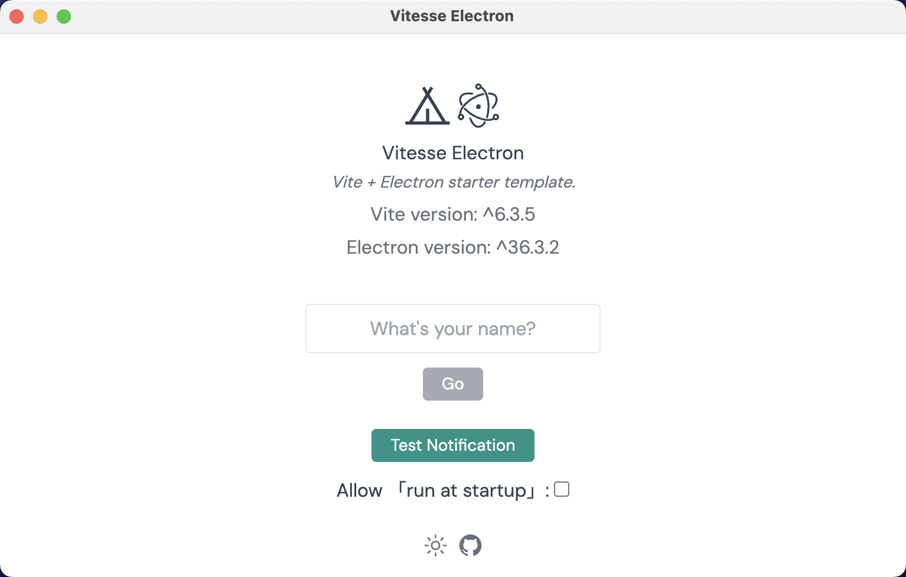

<p align="center">
    
</p>

<h1 align="center">
    Vitesse Electron
</h1>

<p align="center">
    <b>
        <i>Vitesse + Electron模板</i>
    </b>
</p>

<p align="center">
    Fork自
    <a href="https://github.com/antfu/vitesse-lite" target="_blank">antfu/vitesse-lite</a>
</p>

<p align="center">
    <span>
    <a href="./README.md" target="_blank">
        English
    </a>
    </span>
    <span style="margin-inline: 5px;">|</span>
    <span>简体中文</span>
</p>

# 演示

在这里看演示: [Netlify Demo](https://vitesse-superslim.netlify.app/)

# 特性

参考[Vitesse-lite](https://github.com/antfu/vitesse-lite)项目.

# 启动脚本

```shell
# 开发
pnpm run dev

# eslint语法修复
pnpm run lint:fix

# 构建app
pnpm run build:app

# 构建网页
pnpm run build
```

# 开源许可证

[MIT许可证](./LICENSE)

版权所有 (c) 2020-PRESENT Anthony Fu

版权所有 (c) 2025-PRESENT Vincent-the-gamer
